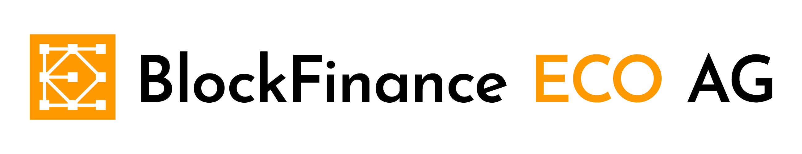

# BLOCKFINANCE-ECO_STARTHACK23

## START- HACK CASE 2023

 

## Case Introduction:

Entrepreneurs and start-up companies looking to incorporate Bitcoin as a payment method for their clients, loans, employee payment, and fund raising can benefit from the START 2023 Hack-Case. Participants will work on challenges related to building their own Bitcoin infrastructure, including Bitcoin nodes, Bitcoin explorer, Bitcoin payment server, and Bitcoin wallets, using open-source tools and affordable hardware. By leveraging the power and security of Bitcoin, entrepreneurs and start-up companies can streamline their business operations and create a seamless payment experience for their customers, all while staying at the forefront of the rapidly evolving world of cryptocurrency.

### Problem

The future of business is already here, Web 3.0 and Crypto. If you do not get up to speed fast, you will not catch this wave. Be one of the few who know how to ride it early on with some expert guidance to do so safely and with adequate security. Test your ability to do this right and learn by doing now! 
Learn about and experiment with our help, tools, and available hardware: 
-	Set-up your own company with bitcoin payment and funding infrastructure.
-	Know how to accept bitcoin as payment for funding, invoices, etc.
-	Use bitcoin to pay other invoices, your employees, etc.
-	Use tools to document transactions properly to avoid problems with the authorities. 
With our help you can take the chance to focus on building and managing your business rather than on infrastructure and security.

## The Pitch:

- [Pitchdeck - PDF](./BFECO_presentation_StartHack_PitchDeck.pdf)
- [Pitchdeck - PPT](./BFECO_presentation_StartHack_PitchDeck.pptx)

## Deep Dive Slides:

- [Deep Dive - PDF](./BFECO_presentation_StartHack_DeepDive.pdf)
- [Deep Dive - PPT](./BFECO_presentation_StartHack_DeepDive.pptx)

## Further Information:

### Expected Final Product

By the end of the hack session, you will have created:
- A bitcoin wallet structure using BIP-85 for your company.
- Multiple BIP39 seeds for accounting, salaries, fundraising, etc.
- A company vault wallet that will be used to fund the company derived from the BIP-85 seed.
- Learn the process and proof your ownership of the wallet address by signing a message from one of your addresses with a timestamp. 
- A running bitcoin node with API access and txindex=1 in your bitcoin.conf file. 
- A Bitcoin Payment Server (BTCPay) and connect it to your own Bitcoin node and prove its functionality by (creating your first invoice, using scripting language to access the API, automating it, etc.)
- Small website where you sell one product connected to your Bitcoin Payment Server.
- Documentation for accounting statements of all your Bitcoin wallets.
- A script to add and extract messages from transaction blocks.
- A paperwallet for a present to a fictitious employee.
- Documentation for onboarding with the CryptoBus exchange to be able to exchange Bitcoin for Fiat currency

### Data

The participants in the Hack-Case will have access to:
-	A full Bitcoin blockchain, which will be provided to them to save time on syncing the blockchain.
-	Laptops provided by the organizers (10 units)[1].
-	The CryptoWorkspace platform to verify their results, gather documentation for accounting on Bitcoin transactions, such as address reports, CSV exports, etc. and  metadata to ensure proper accounting of all transactions.
-	A list of Open-Source tools for implementing their infrastructure.
-	Bitcoin professionals throughout the hack case for support and coordination.

[1] we can not ensure Hardware for all teams. Make sure your have 1 TB of free space on your own device you are bringing. 

### Technology

The technology stack will be focused on Bitcoin and will include tools such as Bitcoin nodes, Bitcoin explorers, Bitcoin payment servers, and Bitcoin wallets. Overall, the Hack-Case is designed to give participants a hands-on experience of building their own Bitcoin infrastructure and incorporating it into their business operations.

### Use Case (and Business Case)

The Hack-Case is meant to simulate real-world scenarios that entrepreneurs and start-ups may encounter when using Bitcoin in their business operations with no specific use case, so that its participants can customize it to their business needs. With the Hack-Case participants will be exposed to all the elements that have to be considered from start to finish to be able to use Bitcoin in their day to day for business. In essence one can summarize it as learning how to set up their own Bitcoin infrastructure, and how to use it to manage their company's finances, dealing with exchanges, for Bitcoin conversion, etc. but also to how to take the necessary step for transaction compliance and safety.

## Resources

- [Participant Resources](/participant_resources.md)

## Point of Contact

We will be glad to answer your questions during the Deep Dive. **We are only available on Discord**

__Discord only:__

- BlockfinanceECO_Michael             ---- Michael
 

- BlockfinanceECO_ConstantinBosse     ---- Constantin

## Prize - the winning team members will each receive:

__Crypto is equality 
(as the START rules dictate the winner has to get it all, but…)__

__1st.__  Blockfinance ECO AG has a sister company, Nautilus Cyberneering S.L.U, located in Gran Canaria, Canary Islands. Nautilus Cyberneering is dedicated to building open-source ecosystems where user-creator communities collaborate to develop secure and respectful software that adds value for future generations. As a reward for the Hack-Case winner, they will get the opportunity to visit the Nautilus Cyberneering team in Gran Canaria and spend a week on the island and a day with the international team, experiencing the exciting work of open-source development firsthand.

|
|

|

[Image Credits](./images/Unsplash Image credits.txt)

__2nd - 3rd__	Bitcoin Hardware Wallets and Bitcoin BLOCKCLOCK™ micro

 | |

(Images from https://trezor.io/ and https://shiftcrypto.ch/de/bitbox02/ https://blockclockmicro.com/ ) 

### Challenges and Evaluation Criteria:

- Setting up a Bitcoin wallet structure using BIP-85 (Bitcoin Improvement Proposal 85) involves creating a hierarchical deterministic (HD) wallet to securely store and manage your company's Bitcoin funds. BIP-85 provides a way to structure the HD wallet into multiple segments or accounts, allowing you to allocate specific funds for accounting, salaries, fundraising, etc. By creating multiple BIP39 seeds, you can ensure that each account has its own unique seed for added security and backup purposes. This structure ensures that your company's Bitcoin funds are managed in a secure and organized manner, making it easier to track and access them as needed. 
(10 points)
- Create a Bitcoin company vault wallet that will be used to fund the company derived from the BIP-85 seed. (5 points)

- Raise funds on your fundraising Bitcoin wallet, which is also set up from the BIP-85 wallets, and get funded from the angel investor at the Blockfinance ECO AG booth. To receive your angel investment, you need to sign a message from one of your addresses in your Bitcoin fundraising wallet and send it to the Blockfinance ECO AG team on Discord or personally. Use the https://github.com/Blockfinance-ECO/Bitcoin-Value-Assert tool to create the timestamp and message of your fundraising Bitcoin wallet. (10 points)

•	Ensure you run your Bitcoin node with API access and txindex=1 in your bitcoin.conf file. (10 points)

- Set up your Bitcoin Payment Server (BTCPay) and connect it to your own Bitcoin node. (10 points)
  - additional 15 point for: 
  - Create your first invoice and send the link to Blockfinance ECO AG staff for review (3 points). Use 5€ as the total payment amount.
  - Access the API of the Bitcoin payment server and write a wrapper in a scripting language of your choice or set up a small website to:
  - •	Set up a product for sale.
  - Generate an automated invoice using the API for this product.
  - Check if the invoice was paid, save everything related to the payment in a local database of your choice.
  - Automatically move 75% of the invoice money to your company vault wallet.  (https://docs.btcpayserver.org/CustomIntegration/, https://docs.btcpayserver.org/API/Greenfield/v1/)
  - Get creative and show some more possible use cases (not getting more points for it, just for yourself and your later success) 

- Provide accounting statements of all your Bitcoin wallets using the Bitcoin wallet of choice or the CryptoWorkspace with the transaction lookups and CSV exports. Add additional metadata to each transaction for your accountant to understand each transaction. (5 points)

- Extract the hidden message in the Bitcoin Genesis Block (https://en.bitcoin.it/wiki/Genesis_block) using your Bitcoin node. (5 points)

- Write a script that looks for Bitcoin messages in every other Bitcoin block. (5 points)

- Create one paperwallet for a newborn baby of one of your employees. (don’t fund it , just create one with a greeting card) (5 points)

- Participants should make sure to acquire the necessary documentation for onboarding with the designated Bitcoin exchange, CryptoBus, to buy or sell Bitcoin for Swiss Francs. They should approach the exchange during the Hack-Challenge and provide their company name to begin the onboarding process. It is important to inquire with the exchange regarding any specific requirements for onboarding. You need to independelty look for the CryptoBus to get a chance for onboarding. (15 points)

- Be creative surprise us and show how it adds value (5 points).

[1] we can not ensure Hardware for all teams. Make sure your have 1 TB of free space on your own device you are bringing. 

